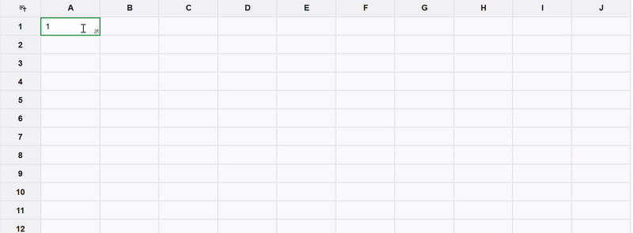
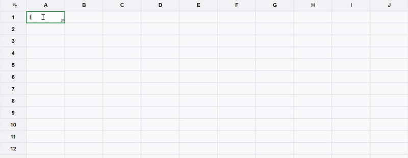

# React Grid

This React application is a spreadsheet implementation without any external library.

## Features

1. **Column Resizing**
2. **Row Resizing**
3. **Selection**
4. **Copy-Paste**
5. **Sorting**
6. **AI Auto-Complete**
7. **Undo Redo**

## Tech Stack

- **Next.js**
- **TypeScript**
- **Tailwind CSS**
- **Gemini AI**

### Resizing


### Single Selection

Select cell this click


### Multi selection Selection

Hold Ctr and select multiple cells


### Range selection Selection

Hold Ctr + Shift for range selection


### Click and drag Selection


### Sorting


### AI Auto Fill

Select the magic icon at the end of non empty cell and drag and select cell that should be used for the ai auto completion.

If current selection is a AI selection the selection color will be blue otherwise green.




## Run locally

Clone repo

```bash
git clone https://github.com/monster-anshu/react-grid.git
cd react-grid
```

Add a `.env` file containing gemini ai api key for auto completion.

```bash
GEMINI_KEY=key
```

Start application

```bash
pnpm i
pnpm dev
```

Open http://localhost:3000
