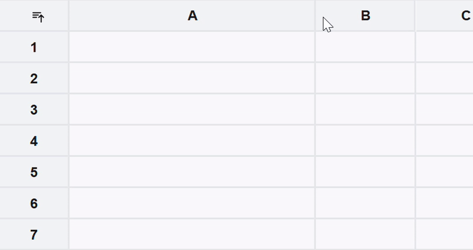
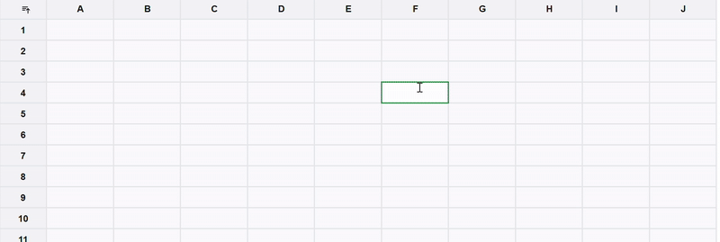
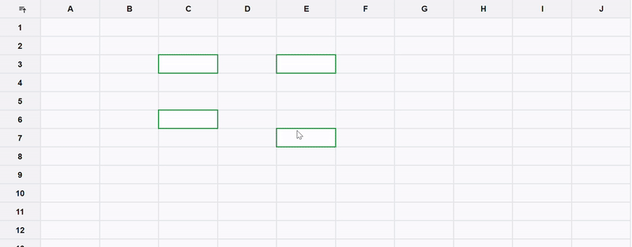
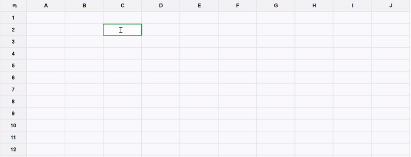
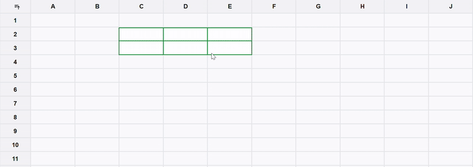
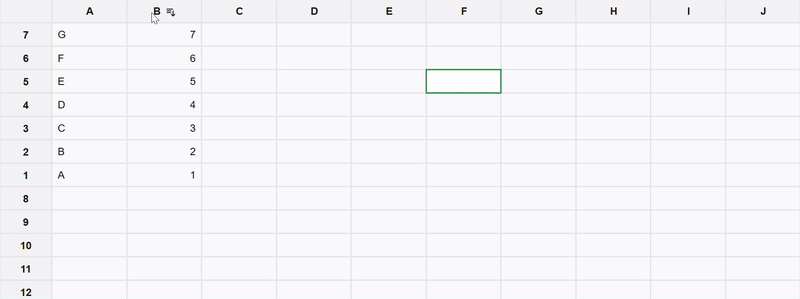

# React Grid

This React application is a spreadsheet implementation without any external library.

## Features

1. **Column Resizing**
2. **Row Resizing**
3. **Selection**
4. **Copy-Paste**
5. **Sorting**
6. **AI Auto-Complete**

## Tech Stack

- **Next.js**
- **TypeScript**
- **Tailwind CSS**
- **Gemini AI**

### Resizing

### Single Selection

Select cell this click

### Multi selection Selection

Hold Ctr and select multiple cells

### Range selection Selection

Hold Ctr + Shift for range selection

### Click and drag Selection

### Sorting

